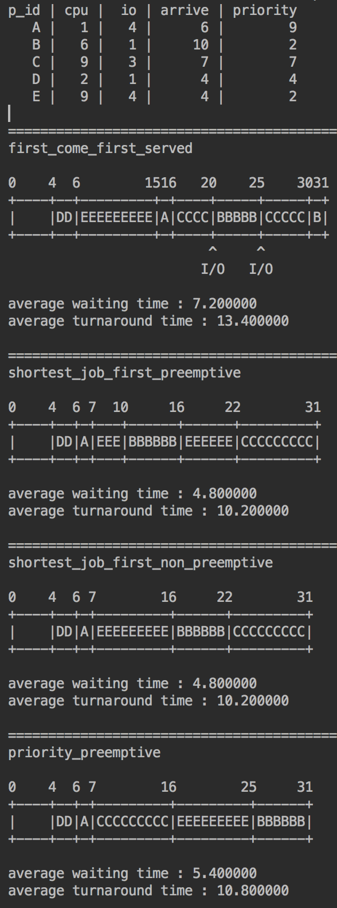
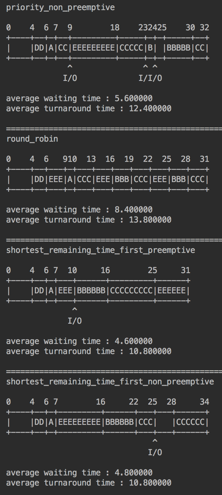
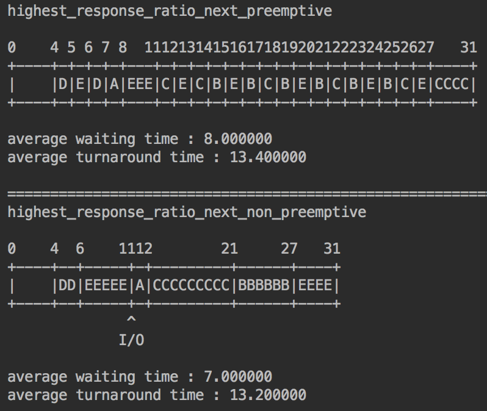

# CPU Scheduling Simulator

### This is an assignment of Operating Systems (COSE341-01) of Korea University in 2018 spring semester

Simulating CPU scheduling algorithms with virtual processes which are consist of randomly generated cpu burst time, io burst time, arrive time, and priority.

I developed this on Clion (Jetbrain IDE)

Every scheduling algorithms are in schedulers.c

## Implemented algorithms

- first_come_first_served
- shortest_job_first_preemptive
- shortest_job_first_non_preemptive
- priority_preemptive
- priority_non_preemptive
- round_robin
- shortest_remaining_time_first_preemptive
- shortest_remaining_time_first_non_preemptive
- highest_response_ratio_next_preemptive
- highest_response_ratio_next_non_preemptive

## Screenshots

 

 

